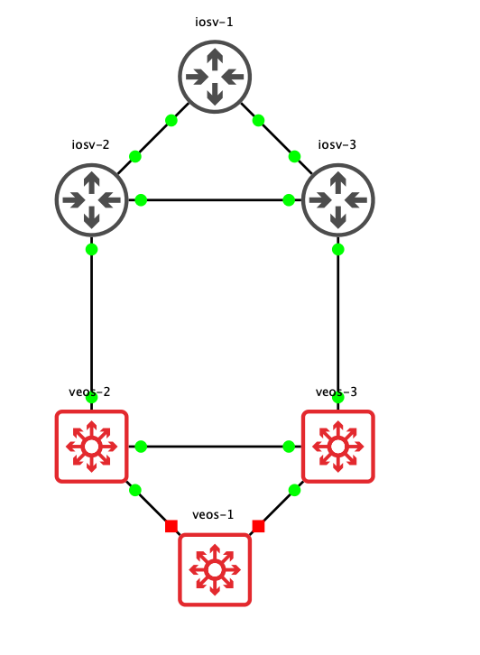

# Drawthe.net converter

The purpose of this script is to read [drawthe.net](http://go.drawthe.net/) YAML files and recreate a GNS3 topology, Powered by Gns3fy.

## Requirements

- Python 3
- [gns3fy](https://github.com/davidban77/gns3fy). Can be installed with `pip install gns3fy`.
- A [drawthe.net](http://go.drawthe.net/) topology file.
- `tabulate`. To pretty print the summary when topology is created, see `requirements.txt`

## How it works

### Topology file

The script parses the data from the topology file from 3 sections:

- **`title`**: It collects the name of the GNS3 project out of the attribute `text`.
- **`icons`**: Where the devices are defined. Each key is mapped to the name of the device in GNS3 and it parses 3 main attributes from them:
  - `x`: The value of the coordinate `x` on the canvas.
  - `y`: The value o the coordinate `y` on the canvas.
  - `gns3_template`: This one is new attribute and is not part of the original specification. It is needed to map the device against a known template in your GNS3 server.
- **`connections`**: Where the links of the topology are defined. It reads the `endpoints` attribute which **MUST** comply to the following format:

`[<device_a>:<port_a>, <device_b>:<port_b>]`.

For example:

```yaml
connections:
  - { endpoints: [router01:Gi0/1, router02:Gi0/1] }
```

For a minimalistic example of a file lets see `example/minimalist_topology.yml`.

```yaml
diagram:
  fill: none
title:
  text: "Minimalistic Demo"
  fill: none
  logoFill: none
  author: netpanda
iconsDefaults: &iconsDefaults
  icon: router
  iconFamily: cisco
  fill: none
icons:
  iosv-1: { <<: *iconsDefaults, gns3_template: "Cisco IOSv L3", x: 2, y: 8 }
  iosv-2: { <<: *iconsDefaults, gns3_template: "Cisco IOSv L3", x: 1, y: 7 }
  iosv-3: { <<: *iconsDefaults, gns3_template: "Cisco IOSv L3", x: 3, y: 7 }
  veos-2: { <<: *iconsDefaults, gns3_template: "Arista vEOS", x: 1, y: 5 }
  veos-3: { <<: *iconsDefaults, gns3_template: "Arista vEOS", x: 3, y: 5 }
  veos-1: { <<: *iconsDefaults, gns3_template: "Arista vEOS", x: 2, y: 4 }
connections:
  - { endpoints: [iosv-1:Gi0/1, iosv-3:Gi0/2] }
  - { endpoints: [iosv-1:Gi0/2, iosv-2:Gi0/2] }
  - { endpoints: [iosv-2:Gi0/3, iosv-3:Gi0/3] }
  - { endpoints: [iosv-2:Gi0/4, veos-2:Ethernet1] }
  - { endpoints: [iosv-3:Gi0/4, veos-3:Ethernet1] }
  - { endpoints: [veos-3:Ethernet7, veos-2:Ethernet7] }
  - { endpoints: [veos-1:Ethernet2, veos-2:Ethernet2] }
  - { endpoints: [veos-1:Ethernet3, veos-3:Ethernet3] }
```

### Run the script

With the topology file created, we just need to run the script:

```shell
python drawthenet_converter.py --topology examples/minimalist_topology.yml --server <gns3vm>
```

You will see the ouput of the script reading the topology file, creating the GNS3 project, then the devices and finally the links!.

For help on how to use the script:

```shell
python drawthenet_converter.py --help
usage: drawthenet_converter.py [-h] [-V] [-v] -t TOPOLOGY -s SERVER
                               [--port PORT] [--protocol {http,https}]

Reads drawthe.net topology file and creates GNS3 Topology

optional arguments:
  -h, --help            show this help message and exit
  -V, --version         show program's version number and exit
  -v, --verbosity       Increase output verbosity
  -t TOPOLOGY, --topology TOPOLOGY
                        YAML/drawthe.net topology file.
  -s SERVER, --server SERVER
                        The GNS3 server address.
  --port PORT           The GNS3 server API port.
  --protocol {http,https}
                        Protocol to use to connect.
```

### Final Outcome, the topology in Gns3



## Considerations

Besides the mandatory fields explained in the section above, there are some considerations and restrictions when using the script:

- The `connections`, specifically the `endpoints` defined need to be devices and ports, it cannot be **groups**.
- The feature of drawthe.net to use the `+` or `-` values on the coordinates to add or substract from the previous value (for example `x: "+1"`) is **NOT** possible to use. You must specify the values.
- Create your own topologies in `/topologies/` as this will be ignored by git, keeping your topology files local.
